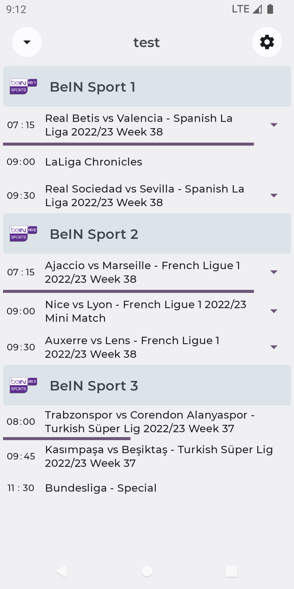

# TV Program Guide

## Features

* Provide epg information for tv channels
* Allow creating different favorites user lists
* Channels reordering with drag and drop
* Scheduling updates
* Allow set notifications for program
* Dark/Light theme support

## UI

#### [Jetpack Compose](https://developer.android.com/jetpack/compose)

TV Program Guide is fully written with Compose, using AndroidView in some cases

## Networking

#### [Retrofit](https://ktor.io/)

A type-safe HTTP client for Android and Java
TV Program Guide use for requests for playlist and epg data and parse responses

## Database

#### [Room](https://developer.android.com/training/data-storage/room)

The Room persistence library provides an abstraction layer over SQLite to allow
fluent database access while harnessing the full power of SQLite

## DI

#### [Hilt](https://developer.android.com/training/dependency-injection/hilt-android)

Hilt is a dependency injection library for Android that reduces the boilerplate of doing manual
dependency injection project.ilt provides a standard way to use DI in application by providing
containers for every Android class in project and managing their lifecycles automatically.
Hilt is built on top of the popular DI library Dagger to benefit from the compile-time correctness,
runtime performance, scalability, and Android Studio support that Dagger provides.

## Misc

#### [Accompanist](https://google.github.io/accompanist/)

Accompanist is a group of libraries that aim to supplement Jetpack Compose with features that are
commonly required by developers but not yet available.
TV Program Guide using navigation animation and permission

#### [Kotlinx-Datetime](https://github.com/Kotlin/kotlinx-datetime)

A multiplatform Kotlin library for working with date and time.

#### [Coil](https://coil-kt.github.io/coil/)

An image loading library for Android backed by Kotlin Coroutines. Coil is:

#### [App Startup](https://developer.android.com/topic/libraries/app-startup)

The App Startup library provides a straightforward, performant way to initialize components at
application startup. Both library developers and app developers can use App Startup to
streamline startup sequences and explicitly set the order of initialization.

## Theming

#### [Material 3 Theming](https://m3.material.io/develop/android/mdc-android)

TV Program Guide is using brand new Material 3. It also supports both light and dark mode depending
on system settings.
[Material Theme builder](https://material-foundation.github.io/material-theme-builder/#/custom) is
used to create material 3 theme and directly export it for Compose.

## Testing

#### [Mockk](https://mockk.io/ANDROID.html)

Mocking library for Kotlin

#### [Kotest](https://kotest.io/)

Kotest is a flexible and elegant multi-platform test framework for Kotlin with extensive
assertions and integrated property testing

## Screenshots

